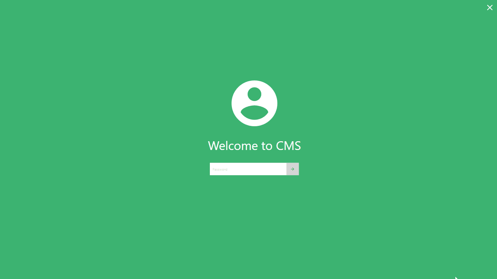

# Class Management Software

> A software for coaching classes

## Features:
* Store student and lecturer data
* Manage batches
* Create weekly timetables with an easy drag-n-drop interface
* Reminders
* Attendance tracking
* Budget logging

## Demo

### Note
Copy or create a symlink to the Database directory in bin\Debug to access the debug database.
