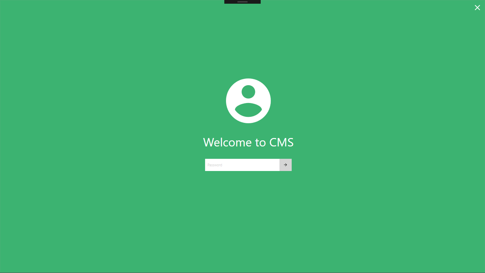
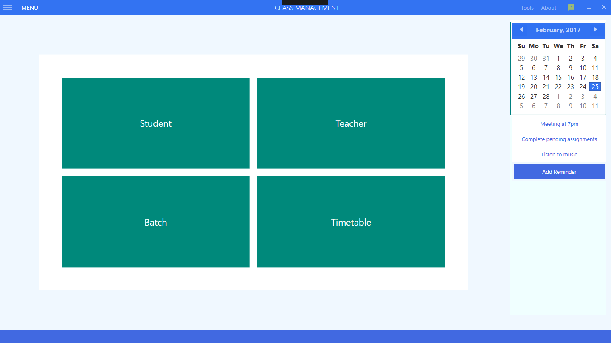
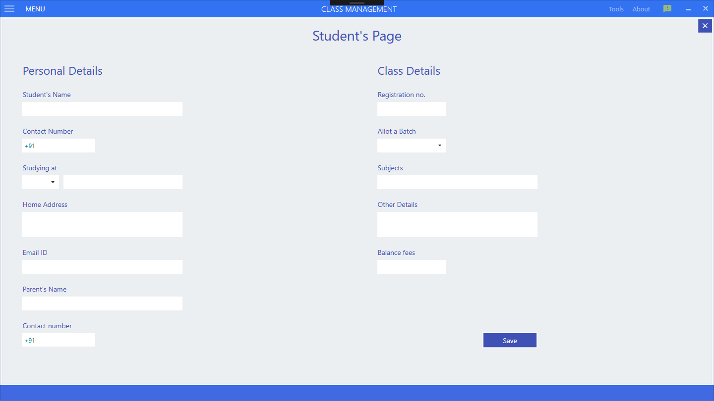
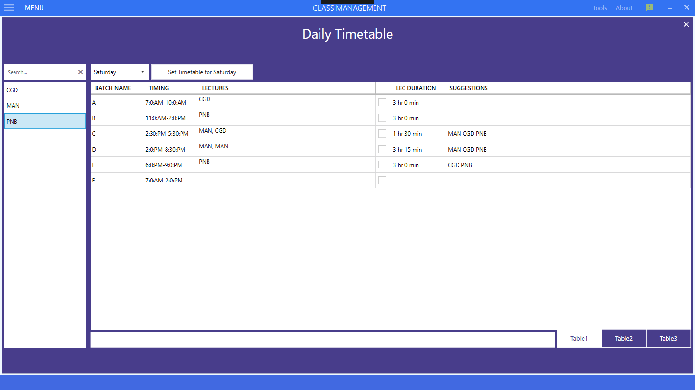

# Class-management-software

> A software for Coaching Classes

## Features:
* Store their student and lecturer data
* Manage batches
* Create timetables using the suggestions generated by the software.

## Screenshots

